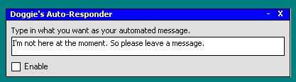



## Msn Messenger Auto\-Responder

### Description

The code allows you to set a automated message while ur busy or away using Msn Messenger and its fully customized for what u want it to say
 
### More Info
 
Before using you need to be logged into Msn Messenger of course

             |
---                |---
**Submitted On**   |2002-03-05 14:39:34
**By**             |[Adrian Doherty](https://github.com/Planet-Source-Code/PSCIndex/blob/master/ByAuthor/adrian-doherty.md)
**Level**          |Intermediate
**User Rating**    |5.0 (15 globes from 3 users)
**Compatibility**  |VB 6\.0
**Category**       |[Internet/ HTML](https://github.com/Planet-Source-Code/PSCIndex/blob/master/ByCategory/internet-html__1-34.md)
**World**          |[Visual Basic](https://github.com/Planet-Source-Code/PSCIndex/blob/master/ByWorld/visual-basic.md)
**Archive File**   |[Msn\_Messen59366342002\.zip](https://github.com/Planet-Source-Code/adrian-doherty-msn-messenger-auto-responder__1-32353/archive/master.zip)

